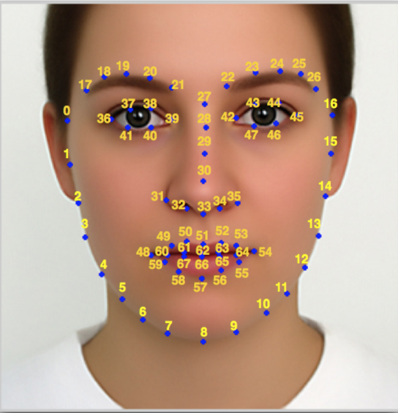

# kiwi FaceTracker

## 1. Intro
FaceTracker1.0 is the software development kit (SDK) provided by our company optimized for mobile devices. The main features provided in the SDK include:
- realtime face detection
- 68 feature point alignment
- 2D live stickers
- face beautifying effects
- facial expression analysis
- facial movement estimation

This SDK has been optimized for good mobile performance and low resource consumption (CPU and memory). This SDK can be quickly integrated with mobile applications with photo & video, live-streaming, virtual reality or augmented reality functions.

This image describes the locations of the 68 feature points provided by this SDK. The feature points capture and track the facial structure when face moves. The corresponding locations of the feature points are categorized in table below.

Table 1. the categories and corresponding locations of the 68 facial feature points.

 locations | points #
 -------------|--------
 Face contour | 1－17
 Left eyebrow | 18－22
 Right eyebrow | 23－27
 Nose bridge | 28－31
 Nose lower edge | 32－36
 Left eye | 37－42
 Right eye | 43－48
 Upper lip | 49－55，61－65
 Lower lip | 56-60，66-68

### Face Detection
Face detection technology detects the approximate location of the face in the frame. The location is offered as the initial estimate of the locations for the 68 feature points. This SDK utilizes an advanced cascade classifier to locate the face location with high performance.

### Face Alignment
Face alignment technology tracks the feature points of human face precisely. We utilize dynamic analysis technologies to estimate facial expression and movements for advanced requirements. This SDK utilizes an advanced cascade Random Forests to extract the face local features and adopts the global regression method to calculate the exact locations of the feature points. It can handle situations like huge variations in facial expressions, angles, illuminations and occlusions effectively.

### Features providing in this SDK:
1. Face and 68 feature points detection in still image
2. Real-time 68 feature points tracking in continuous sequence or video clip (currently only supporting single face
3. Face beautification and other image processing filters
4. Face pose estimation
5. 500+ live sticker artwork

### Features coming up next:
1. Real-time detection and tracking of multi-faces (soon)
2. Facial motion analysis (open mouth, blink, shake head)
3. Faces swapping
4. Gaze estimation
5. Facial expression analysis

## 2. Platforms supported

IOS

* Model: iPhone 5 or later
* Versions: iOS 7.0 or later

Android

* CPU: ARM V7 or later, with NEON
* Versions:  Android 4.0 or later

## 3. Performance Testing
We tested the performance of the SDK on several popular mobile devices. In each test, the CPU occupancies and memory usage are recorded for 5 minutes. The average single frame processing time is computed to show the efficiency of our SDK.

The performance records are shown as following:

__Face feature points tracking performance__

Selected iOS models for test (with face)

Model | CPU Occupancy(%) | Memory Usage (MB) | Single frame Processing time(ms)
------|------------------|-------------------|------------------
iPhone5(8.1) | 24-43 | 24.3-25.4 | 10.3
iPhone6(9.3) | 21-30 |  26.9-27.2 | 6.8
iPhone6p(9.3)| 17-29 | 26.7-27.9 | 7.1
iPhone6s(9.3) | 8-16 | 32.0-33.2 | 3.7

Selected iOS models for test (No face)

Model | CPU Occupancy(%) | Memory Usage (MB) |Single frame Processing time(ms)
------|------------------|-------------------|------------------
iPhone5(8.1) | 26-52 |  24.3-24.6 | 12.5
iPhone6(9.3) | 27-33 |  27.0-28.1 | 8.4
iPhone6p(9.3) | 18-36 |  26.9-28.0 | 9.1
iPhone6s(9.3) | 12-22 |  31.9-33.1 | 5.6

Selected Android models for test (With face)

Model | CPU Occupancy(%) | Memory Usage (MB) |Single frame Processing time(ms)
------|------------------|-------------------|------------------
Samsung S5 | 8-10 | 23.0-24.2 | 10.2
Nexus 5x | 14-15 | 26.5-27.8 | 13.6
Honor 6 plus | 10-13 | 24.5-26.0 | 16.1

Selected iOS models for test (No face)

Model | CPU Occupancy(%) | Memory Usage (MB) |Single frame Processing time(ms)
------|------------------|-------------------|------------------
Samsung S5 | 16-22 |  23.1-25.5 | 12.5
Nexus 5x | 21-22 | 26.2-28.1 | 16.2
Honor 6 plus | 15-20 | 24.2-28.2 | 20.2

## 4. Package Size
IOS
* SDK size: 2M
* Data size: 16M

Android
* SDK size: 2~4.5M
* Data size: 16M
